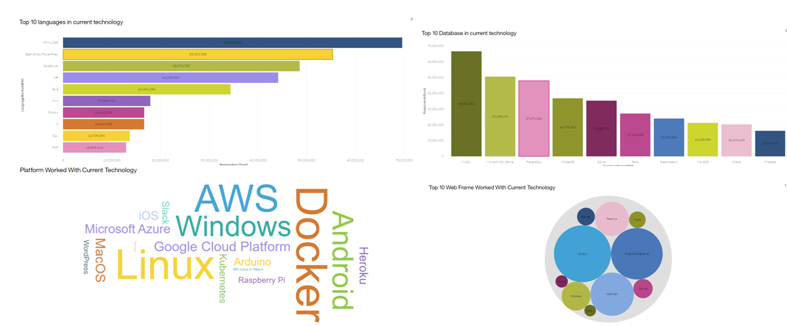
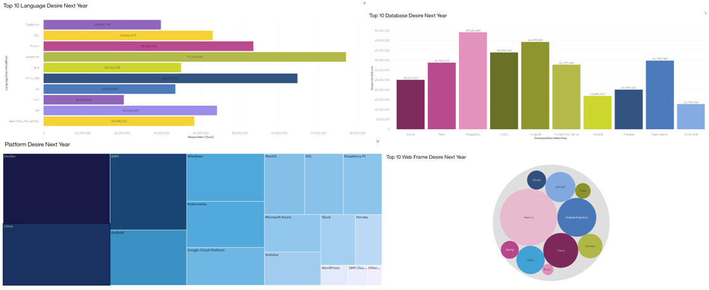
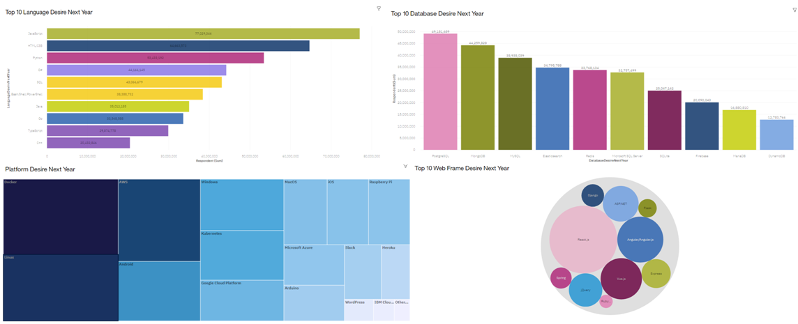

# Technology Trends Analysis
 

This project demonstrated proficiency in applying different Analytical techniques by Analyzing Real-world Datasets, creating
Visualizations & interactive Dashboards, and Presenting Report to  share findings of Data Analysis.
  

## Methodology
 

**Data Collection**
 

  - Our primary data source is internet. Collect our data through under open database license.
[Data Collection](https://github.com/zaid638/IBM-Capstone-Project/tree/6689b746b651a9f6eecf241b7653ee682e45b449/Data%20Collection)
 

**Data Analysis**
 

  - Include cleaning process. Removing duplicates, addressing missing values, and standardizing data formats to ensure consistency and accuracy.
[Data Wrangling](https://github.com/zaid638/IBM-Capstone-Project/tree/809d7420f27c6f8a6f4b1e1a592dba444c1d0574/Data%20Wrangling)
  - Initial data analysis involved descriptive statistics, summarizing key characteristics. Employed statistical analysis techniques such as correlation analysis.
[Exploratory Data Analysis](https://github.com/zaid638/IBM-Capstone-Project/tree/809d7420f27c6f8a6f4b1e1a592dba444c1d0574/Exploratory%20Data%20Analysis)
 

**Trend Identification and Classification**
 

  - Technology trends were categorized based on their primary domains, such as top languages, databases, platforms,web frameworks.
  

## Dashboard
 

### Page1
 

 
### Page2
 

 
### Page3
 

  

## Executive Summary
 

*	JavaScript And Python Are the Most Used Languages In Future
*	NoSQL Databases Like Mongo dB, Elasticsearch Are Also Highly Used in Future
*	There Are No Difference in Platform Used In Current And Future Trends
*	JavaScript Based Webframworks Like Reactjs, Angularjs Are Mostly Used in Future
*	Most Of Our Respondents Are Man and Most of Them Are From United States
*	Most Of Our Respondents Are Between 23 And 31 Years Old
*	Most Of Our Respondents Holds a Bachelor’s Degree
  

## Discussion
 

*	The findings of this analysis offer valuable insights into the trends shaping the technological landscape in programming language, databases, platforms, web frameworks sectors. 
 

*	the most used languages in future are changes with current using languages. new languages are trending in future and some of the languages are not likely using in future.
 

*	the most used databases in future are changes with current using databases. new databases are trending in future and some of the databases are not likely using in future.
 

* there is no difference in platform used in current and future trends and JavaScript based webframworks like reactjs, angularjs are mostly used in future
  

## Overall findings & implications
 

*	Most of our respondents are man.
  - The overrepresentation of men among respondents may lead to gender-biased insights in your analysis.
*	Most of them are from united states
  -	Given that a significant portion of your respondents are from the United States, your findings may be particularly relevant to this region. 
*	Most of our respondents are between 23 and 31 years old .
  -	The concentration of respondents between the ages of 23 and 31 suggests that your findings may be more reflective of the preferences and behaviors of this age group. 
*	Most of our respondents holds a bachelor’s degree.
  -	The prevalence of respondents holding bachelor's degrees indicates a higher level of education among your sample. 
  

## Conclusion
 

*	Embracing JavaScript and python, exploring NoSQL database solutions, maintaining platform consistency, and leveraging JavaScript-based web frameworks are essential steps for remaining competitive in the evolving tech landscape.
 

*	 additionally, addressing demographic biases in future research efforts will ensure more comprehensive and representative insights for informed decision-making. Ultimately, staying attuned to these trends and demographic profiles is vital for success in the dynamic world of technology
   

